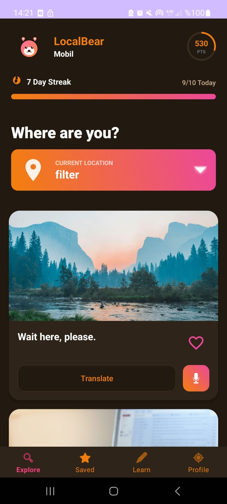
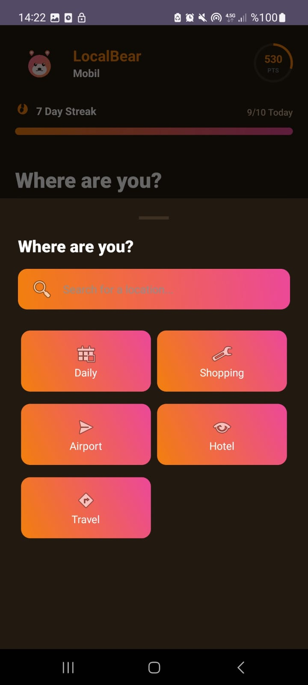
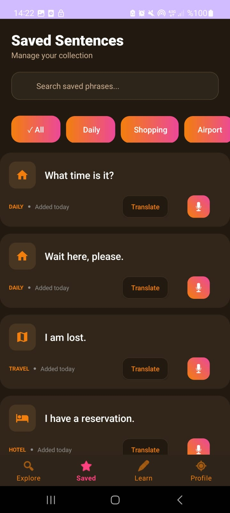
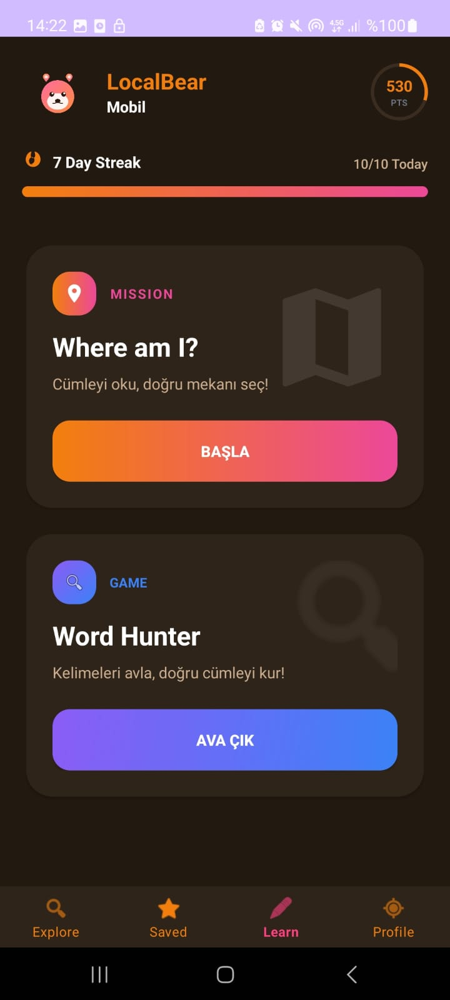
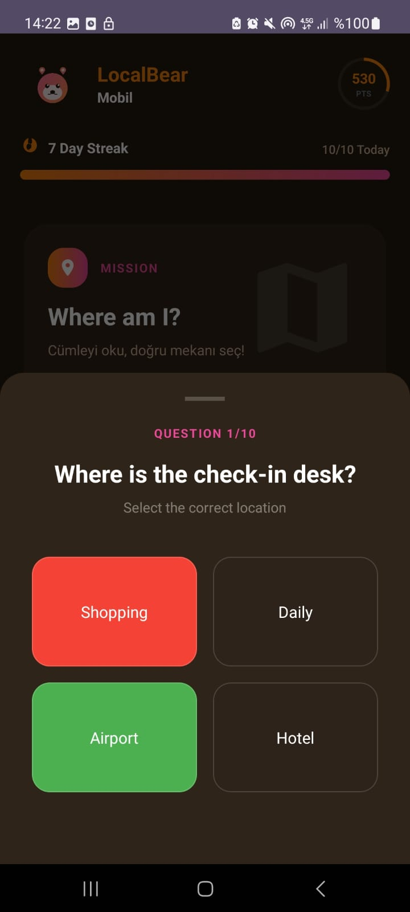
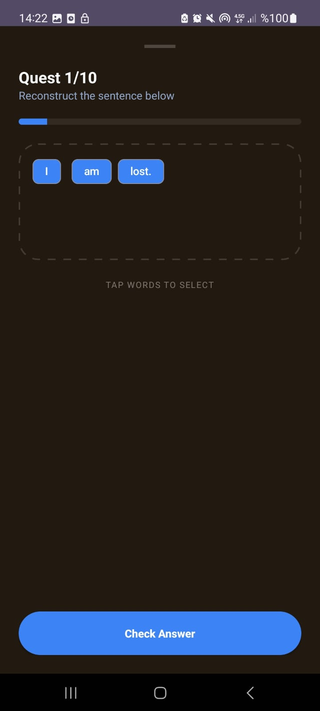

#  LocalBear

LocalBear, kullanıcıların günlük senaryolara (Coffee Shop, Airport vb.) göre seçtikleri mekanlarda pratik yapmalarını sağlayan, oyunlaştırma odaklı bir Android uygulamasıdır.

## ✨ Öne Çıkan Özellikler
* **Senaryo Tabanlı Öğrenme:** Kullanıcıların GPS izni gerekmeden manuel mekan seçerek bağlam içinde çalışması.
* **İnteraktif Oyunlar:** 'Where am I?' ve 'Word Hunter' modları ile eğlenceli pratik.
* **İlerleme Sistemi:** Günlük seri (Streak), anlık puan takibi ve "8/10 Today" hedef göstergesi.
* **Modern Arayüz:** Gradyanlı ilerleme çubukları, dairesel puan göstergeleri ve Stitch esintili tasarım.

## 🛠️ Teknik Özellikler
* **Dil:** Kotlin
* **Veri Yönetimi:** Firebase Firestore (Gerçek zamanlı senaryo verileri)
* **Mimari:** ViewBinding ve Material Design 3 bileşenleri

## 📸 Ekran Görüntüleri

### Ana Ekranlar
| Ana Sayfa | Kategori Seçimi | Kaydedilenler |
| :---: | :---: | :---: |
|  |  |  |

### Öğrenme ve Oyun Modları
| Öğrenme Sayfası | Oyun 1 (Where am I?) | Oyun 2 (Word Hunter) |
| :---: | :---: | :---: |
|  |  |  |

> LocalBear'in modern arayüzü, dairesel puan sistemi ve senaryo tabanlı mekan seçimleri yukarıda gösterilmiştir.